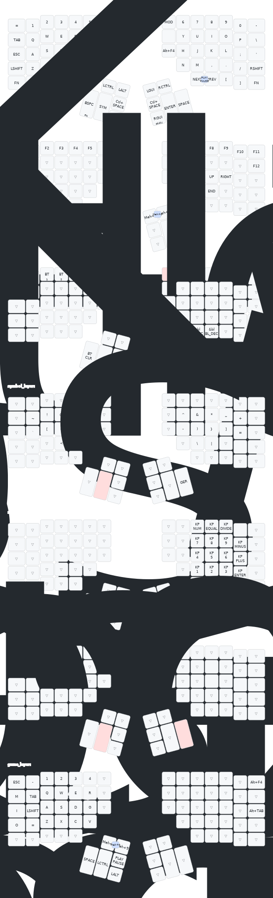

# ZMK Firmware Configuration

Configuration for Kinesis Advantage 360 Pro keyboard using ZMK firmware.

## Keymap



## Build Instructions

```bash
# Install dependencies
west init -l config
west update
west zephyr-export

# Build firmware
west build -b adv360pro_left
west build -b adv360pro_right

# Flash firmware
west flash
```

## Keymap Visualization

This repository uses [keymap-drawer](https://github.com/caksoylar/keymap-drawer) to automatically generate keymap visualizations from the ZMK keymap files.

The keymap diagram is automatically updated via GitHub Actions whenever keymap files change. You can also manually trigger the workflow from the Actions tab.

### Manual Regeneration

To regenerate the keymap visualization locally:

```bash
# Install keymap-drawer
pipx install keymap-drawer

# Parse keymap to YAML
keymap parse -c draw/config.yaml -z config/adv360pro.keymap > draw/adv360pro_keymap.yaml

# Generate SVG
keymap draw -c draw/config.yaml draw/adv360pro_keymap.yaml > draw/adv360pro.svg
```

## Layers

- **DEF** - Default layer with Colemak-DH layout
- **FN** - Function layer with F-keys and navigation
- **MOD** - Modifier layer with media and system controls
- **SYM** - Symbol layer with special characters
- **NUM** - Number pad layer
- **GER** - German characters layer
- **GAME** - Gaming layer with WASD

## Hardware

- **Keyboard:** Kinesis Advantage 360 Pro
- **Firmware:** ZMK
- **Layout:** Colemak-DH with urob's transform
